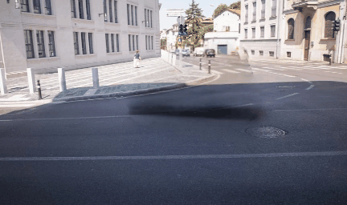
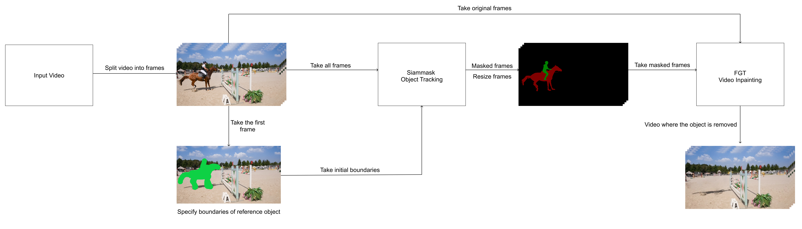

# Video Inpainting using Deep Learning Algorithms (Video Object Remover)
[Oğuz Akif Tüfekcioğlu](https://github.com/oguzakif), [Hüseyin Koçlar](https://github.com/huseyinkoclar)

****

   <a href='https://huggingface.co/spaces/oguzakif/video-object-remover'></a>  [](https://youtu.be/CEP5YLce6Fs)
   
## Examples
  |   |   |
:-------------------------:|:-------------------------:
 |  
  |  


## Introduction
- Video object remover provides an easy object remover process for all types of users.
- We have integrated FGT and Siam Mask models to provide inpainting process automatically. In the first stage user uploads the video and paints the area that are going to be removed. After clicking the run button Siam Mask makes a segmentation according to given area and pass it to FGT model. FGT model inpaints the object areas according to given mask and original frames. 
- The main goal of the project was to make object removal from video as easy as possible for all types of users and to make it as simple as possible, using open source models for architecture and ease of maintenance.





## Getting Started
### Installation

**1. Prepare the code and the environment**

Git clone our repository, creating a python environment and activate it via the following command

```bash
git clone https://github.com/oguzakif/video-object-remover.git
cd video-object-remover
pip install -r requirements.txt
```

**2. Prepare the pretrained model weights**

Video object remover works with pretrained Siam Mask and FGT model. Tests were completed with DAVIS version models.

FGT model can be accessed via [FGT](https://github.com/hitachinsk/FGT) repository.
Siam Mask model can be accesses via [Siam Mask](https://github.com/foolwood/SiamMask) repository.

### Launching Demo Locally

Try out our demo [app.py](app.py) on your local machine by running

```
python app.py
```

By uploading the repository to the hugging face spaces the project can be runned easily. You can also easily stand up your own app by duplicating from our hugging face space repository. Due to the requirements of the video rendering process, we recommend you to get a GPU upgrade or run it locally and use it with the existing CUDA supported GPU on your computer. 
## Acknowledgement

+ [Siam Mask](https://github.com/foolwood/SiamMask) is the segmentation part of the project. All of the codes and models from the original Siam Mask repo. Check it out if you want to learn more about segmentation process.

+ [FGT](https://github.com/hitachinsk/FGT) is the inpainting part of the project. All of the the codes and models from the original FGT repo. Check it out if you want to learn more about inpainting process. 

## License
This repository is under [MIT License](LICENSE).